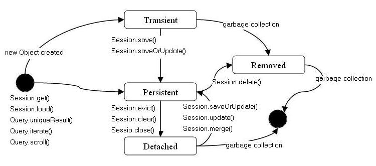

#Cykl życia

Hibernate zajmuje się przechowywaniem obiektów z naszego programu.
Obiekty te mogą znajdować się w różnych stanach, które określają w jaki sposób hibernate będzie się nimi interesował i zajmował.

#### 4 stany
- transient - obiekty w tym stanie są niewidoczne dla hibera. 
Znajdują się tu wszystkie nowo stworzone obiekty, dopóki nie zapiszemy ich w bazie.

- persistent - obiekty przechodzą do tego stanu na czas zapisu lub odczytu, czyli kiedy odpalamy session.save(), load itp.
Mogą pozostać w nim dłużej jeśli pracujemy wewnątrz transakcji. Wtedy podczas całej transakcji z zapisem lub odczytem utrzymywany jest ten stan. 
Ulubiony stan hibera

